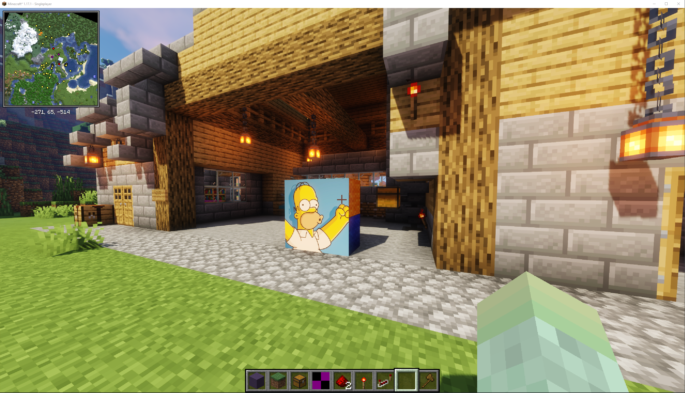
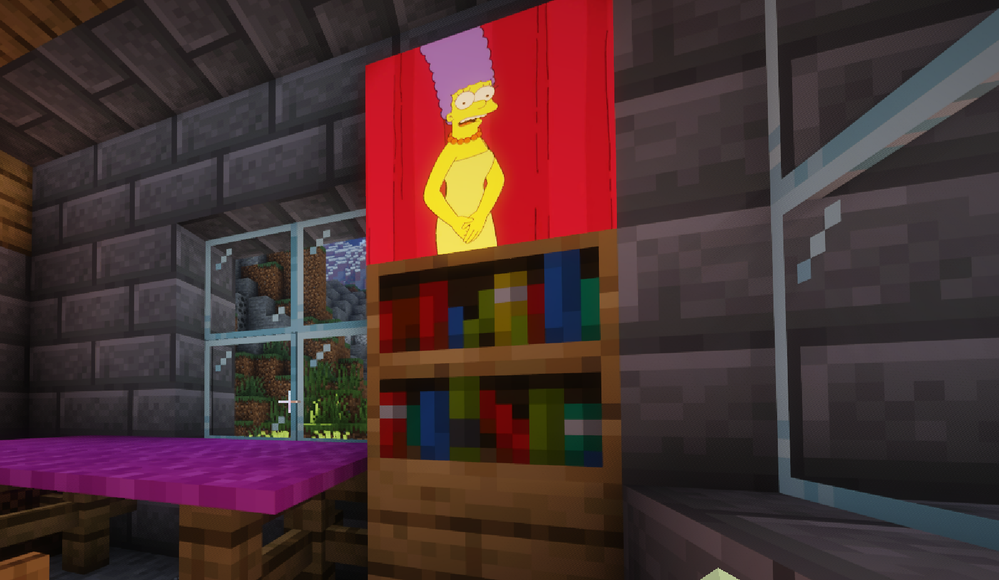
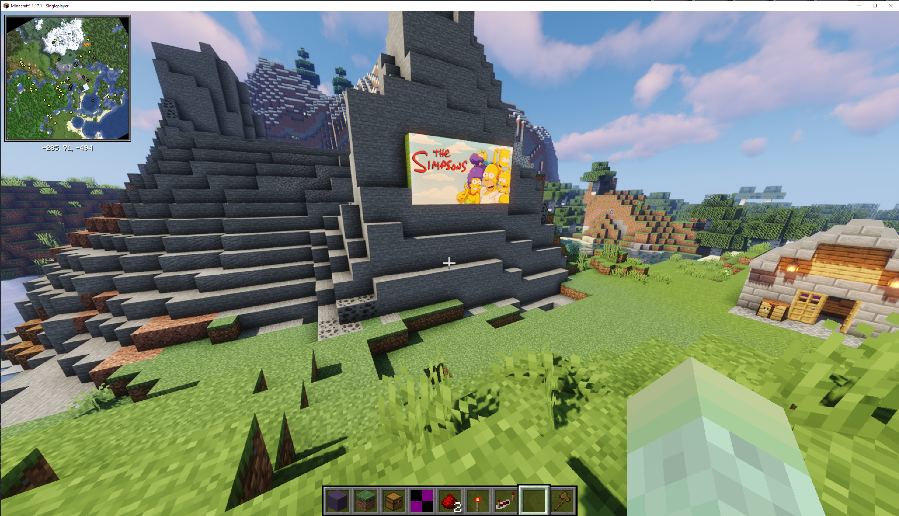

# Projector Mod for Fabric

Projector Mod is a client side mod that adds a custom picture block that can display images from the internet in your Minecraft world.
Project can work both on the client and the server, when installed as a server side mod, projector will sync the currently displayed images to all clients.

Join our [Discord server](https://discord.gg/R2pma3Jfae) for support, suggestions and feature requests.

## Usage

To display a picture, you need to create a picture block, currently this can be done in creative mode by selecting the `picture_block` item from the inventory. In a future release it will be possible to create picture blocks from recepies without needing to use Creative Mode. 

The size of the displayed picture is controlled by placing picture blocks next to each other. The picture will be scaled to fit the size of the connected blocks. As a minimum you have to have a single block, as shown in the example below.

But there is no real limit to the size of picture blocks that you can place.

To set an image to be displayed, you need to press `shift` + the `interact button (right click)` on the picture block. This will open a dialog box that allows you to set the URL for the image. In the instance of a connected picture blocks, only the bottom right hand picture block can be used for setting the images.

At present you can add up to 5 images to a picture block. Interacting with the picture block (right click) will cycle through each of the images. Eventually
we plan to add more features to the mod, such as an increase number of settable images, and a carousel mode that will automatically cycle through the images.

When using the mod in a server environment, the currently selected image is synced to all clients, so that all clients will display the same image.

## Setup
This mod requires [Fabric](https://fabricmc.net/), the [Fabric API](https://www.curseforge.com/minecraft/mc-mods/fabric-api), and minecraft 1.17.1 or later.

To use the mod you can download the latest jar from the [releases] section of this repository. Copy this to your Minecraft mods folder. If you are planning to use this mod on a server, you will need to copy the jar to the mods folder of your server.

## Shaders

Currently Projector does not work with the current release of [Iris Shaders for Fabric](https://irisshaders.net/), however it does work with an up and coming release. All of the screenshots in this readme are rendered using a pre-release of the [Iris Shaders for Fabric](https://irisshaders.net/) mod. Other shaders like OptiFabric have not been tested.

## License

This template is available under the CC0 license. Feel free to learn from it and incorporate it in your own projects.

## TODO
[] Ensure aspect ratio is correctly maintained for images when added to blocks  
[] Improve caching for downloaded images  
[] Add ability to fine tune the image display  
[] Carousel mode, allowing the automatic switching of images  
[] Beamer mode, allowing a picture to be projected onto a surface  
[] Publish to CurseForge and other places  