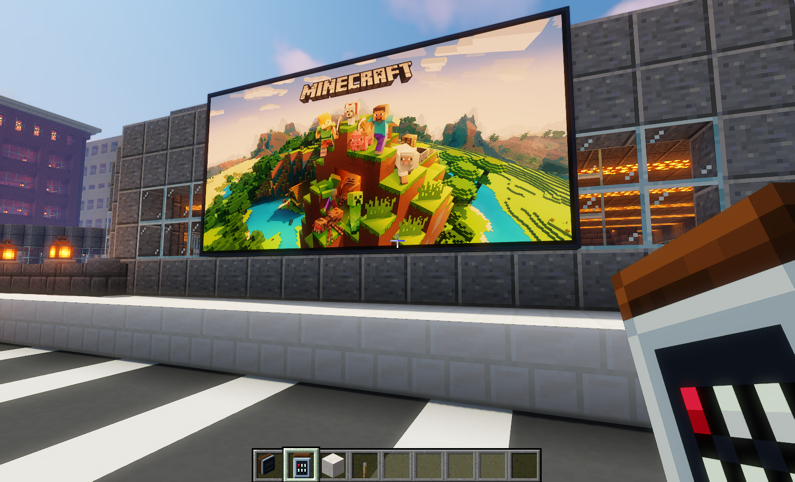
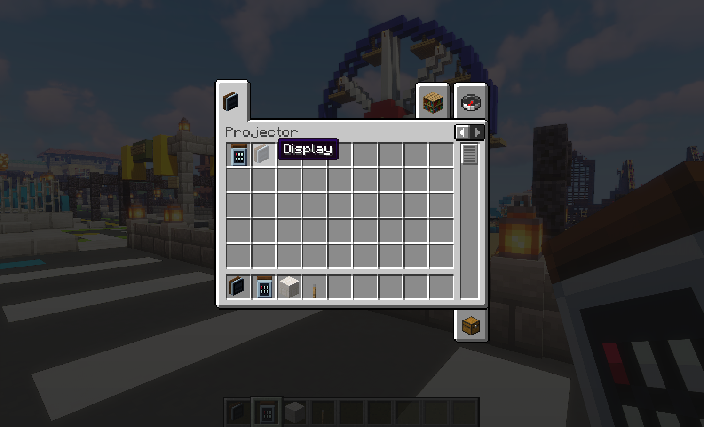
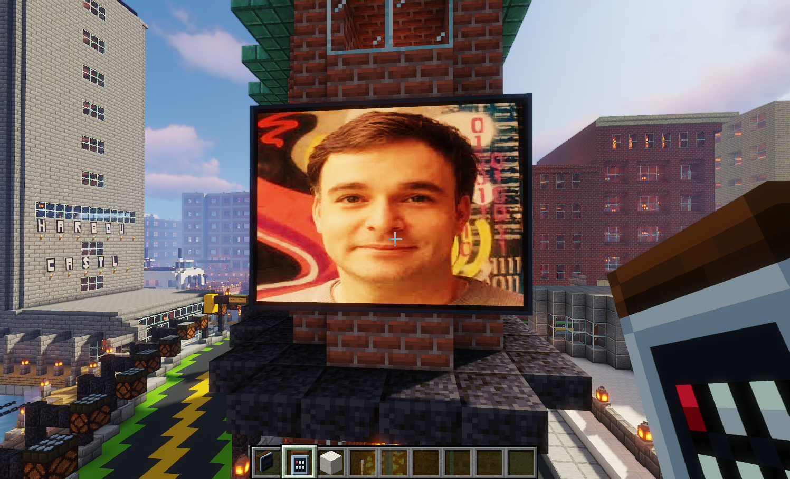
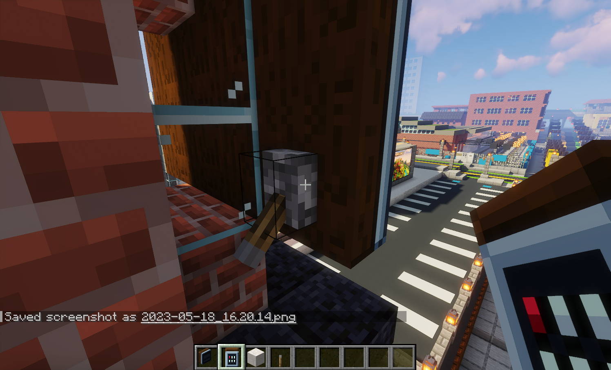
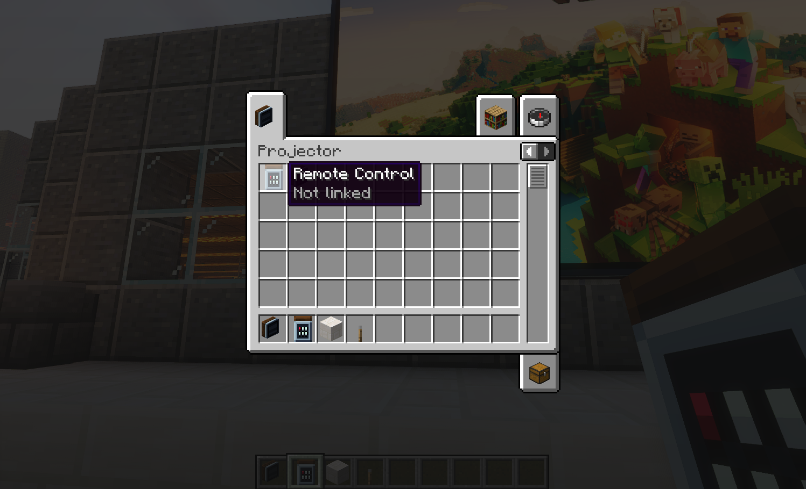
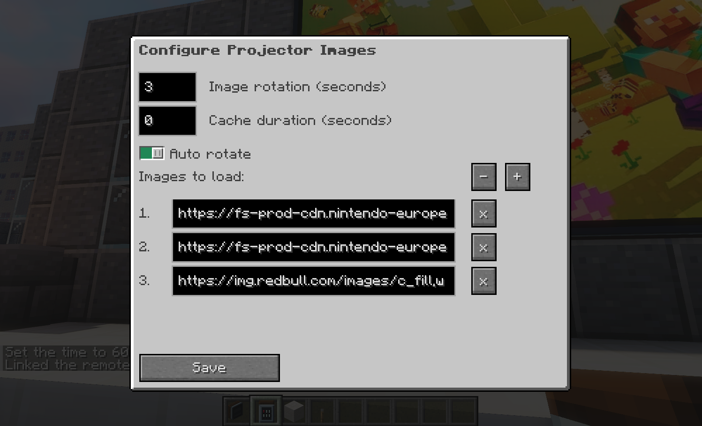
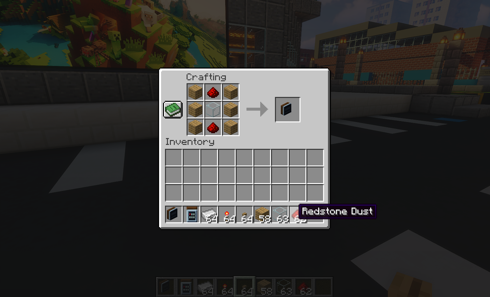
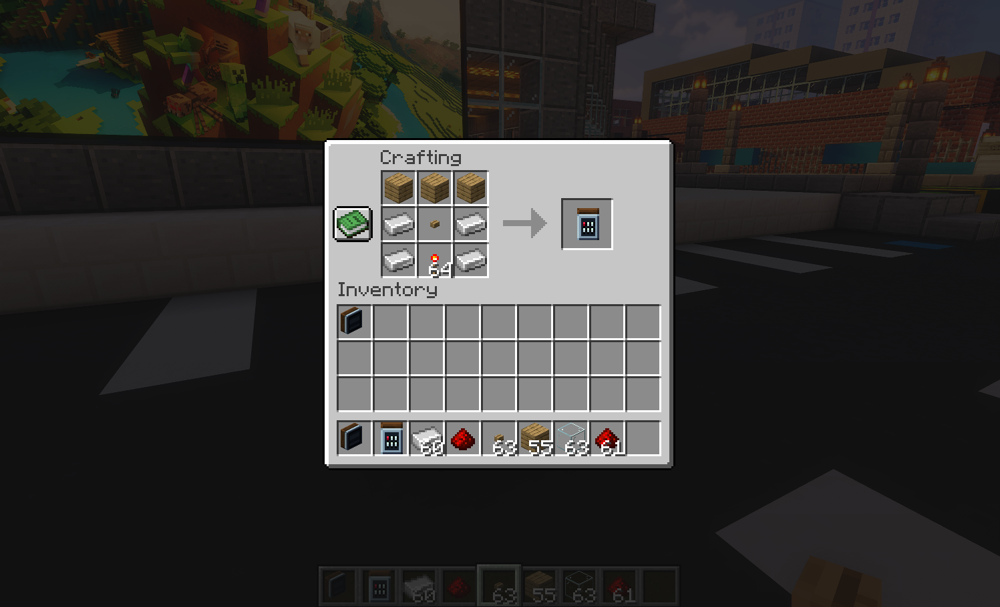

# Projector Mod for Fabric

Projector Mod is a client side mod that adds a custom picture block that can display images from the internet in your Minecraft world.
Project can work both on the client and the server, when installed as a server side mod, projector will sync the currently displayed images to all clients.



Join our [Discord server](https://discord.gg/R2pma3Jfae) for support, suggestions and feature requests.

## Usage

To display a picture, you need to create a picture block, currently this can be done in creative mode by selecting the `Display` item from the `Projector` tab in your inventory. 



The size of the displayed picture is controlled by placing picture blocks next to each other. The picture will be scaled to fit the size of the connected blocks. As a minimum you have to have a single block, as shown in the example below.



But there is no real limit to the size of picture blocks that you can place.

### Redstone power
To display a picture blocks must be redstone powered, at present any signal will do, we plan to add other blocks that integrate with redstone for example, to change the displayed picture at a later date.



### Configuring Displays

To set an image to be displayed, you need a remote, you can get this from the `Projector` tab, remotes are linked to a `Display`. 


To link a remote and to configure the `Display`, right click the `bottom left` Display block. You will see the configuration menu.



Multiple images can be added to the Display, you can either use the remote to manually cycle through the images, or you
can configure the `Image rotation` duration and set `Auto rotate` to auotmatically cycle through the images.

In the previous example the images would be changed every `3` seconds.

By default an image is cached indefinately, this stops Projector from constantly downloaind the image from the internet.
In certain circumstances you may not want this, for example you would like to display an image whos URL
does not change but the image is automatcially refreshed. In this instance you can set the `Cache duration` to the
duration you would like an image to exist for. When `Cache duration` expires the image will be re-downloaded from
the internet. 

### Switching images

To cycle through the images in your `Display`, you can use the `Remote`, holding a linked `Remote` in your hand
and pressing the `Right` mouse button will change the image to the next one in the list. You do not need to
click on the `Display` to change images. After all the `Remotes` use Infra-Redstone.

### Templating variables

You can set environment variables on your server that enable you to automatically set a base url for an image.
For example, if the server has the environment variable `PROJECTOR_base` set to the value `https://mydomain.com`.
Then in the image url you can use the template variable `{base}` and it will automatically be replaced with the 
value of the environment variable.

```shell
{base}/myimage.jpg
```

Only environment variables starting with `PROJECTOR_` are read from the server, no other server
environment variable is sent to the client.

### Crafting
To create a `Display` in survival mode a recipe must be used consisting of 6 x Oak Planks, 1 x Redstone Dust, and 1 x Glass Block.



To create a `Remote` in survival mode a recipe must be used consisting of 3 x Oak Planks, 1 x Oak Button, 4 x Iron Ingots, and 1 x Redstone Torch.



## Setup
This mod requires [Fabric](https://fabricmc.net/), the [Fabric API](https://www.curseforge.com/minecraft/mc-mods/fabric-api), and minecraft 1.17.1 or later.

To use the mod you can download the latest jar from the [releases] section of this repository. Copy this to your Minecraft mods folder. If you are planning to use this mod on a server, you will need to copy the jar to the mods folder of your server.

## Shaders

Currently Projector works with the current release of [Iris Shaders for Fabric](https://irisshaders.net/). All of the screenshots in this readme are rendered using the [Iris Shaders for Fabric](https://irisshaders.net/) mod, and Sildurs Extreeme Shaders. Other shaders like OptiFabric have not been tested.

## License

This mod is available under the CC0 license. Feel free to learn from it and incorporate it in your own projects.